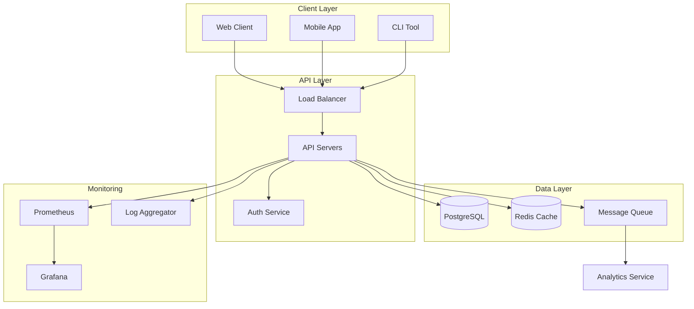
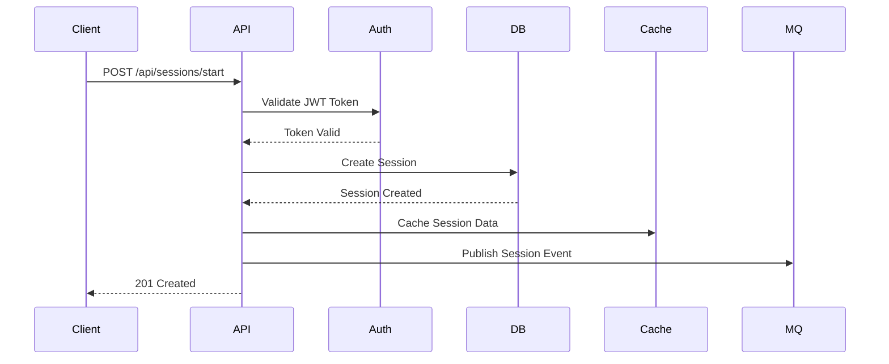

# Call Session Management System

A robust, scalable backend service for managing call sessions and their events, built with Go and PostgreSQL.

## System Overview

The Call Session Management System is designed to handle and track call sessions, their events, and associated metadata. It provides a RESTful API for session management, event logging, and real-time monitoring.

## System Architecture

### High-Level System Diagram



### Sequence Diagram for Session Creation



## Key Features

- **Session Management**

  - Create and track call sessions
  - Real-time session status updates
  - Session event logging
  - Session metadata management

- **Authentication & Authorization**

  - JWT-based authentication
  - Role-based access control
  - Secure token management

- **Scalability**

  - Horizontal scaling support
  - Database sharding ready
  - Caching layer integration
  - Message queue for event processing

- **Monitoring & Observability**
  - Request/response logging
  - Performance metrics
  - Error tracking
  - Health checks

## Technology Stack

- **Backend**: Go (Golang)

  - Gin web framework
  - GORM for database operations
  - JWT for authentication

- **Database**: PostgreSQL

  - ACID compliance
  - JSONB support
  - Efficient indexing

- **Infrastructure**
  - Docker containerization
  - Kubernetes orchestration (planned)
  - Redis caching (planned)
  - Message queue (planned)

## Getting Started

### Prerequisites

- Go 1.21 or higher
- PostgreSQL 14 or higher
- Make (optional, for using Makefile)

### Installation

1. Clone the repository:

   ```bash
   git clone https://github.com/vasu74/Call_Session_Management.git
   cd Call_Session_Management
   ```

2. Install dependencies:

   ```bash
   go mod download
   ```

3. Set up environment variables:

   ```bash
   cp .env_example .env
   # Edit .env with your configuration
   ```

4. Run the application:
   ```bash
   go run cmd/main.go
   ```

### Development Setup

1. Install development tools:

   ```bash
   go install github.com/cosmtrek/air@latest  # For live reload
   go install github.com/golangci/golangci-lint/cmd/golangci-lint@latest  # For linting
   ```

2. Start development server with live reload:
   ```bash
   air
   ```

## API Documentation

Detailed API documentation is available in the `docs/api/Readme.md` file. It includes:

- Authentication endpoints
- Session management endpoints
- Request/response examples
- Error handling

## Architecture Documentation

For detailed architecture documentation, including:

- System design decisions
- Database schema
- Scaling considerations
- Security measures

See `docs/Architecture/Readme.md`

## Project Structure

```
.
├── cmd/
│   └── main.go           # Application entry point
├── internal/
│   ├── config/          # Configuration management
│   ├── middleware/      # HTTP middleware
│   ├── model/           # Data models
│   └── Routes.go        # Route definitions
├── docs/                # Documentation
│   ├── Architecture/    # Architecture documentation
│   └── api/            # API documentation
├── .env                 # Environment variables
├── .env_example        # Example environment variables
├── .gitignore          # Git ignore file
├── go.mod              # Go module file
├── go.sum              # Go module checksum
└── README.md           # This file
```

## Contributing

1. Fork the repository
2. Create your feature branch (`git checkout -b feature/amazing-feature`)
3. Commit your changes (`git commit -m 'Add some amazing feature'`)
4. Push to the branch (`git push origin feature/amazing-feature`)
5. Open a Pull Request

## Testing

Run the test suite:

```bash
go test ./...
```

## Deployment

### Docker Deployment

1. Build the Docker image:

   ```bash
   docker build -t call-session-management .
   ```

2. Run the container:
   ```bash
   docker run -p 8080:8080 --env-file .env call-session-management
   ```

### Kubernetes Deployment (Planned)

Kubernetes deployment manifests will be added in the `k8s/` directory.

## Monitoring

The system includes:

- Prometheus metrics endpoint at `/metrics`
- Health check endpoint at `/health`
- Structured logging with correlation IDs

## Security

- JWT-based authentication
- Role-based access control
- Input validation
- SQL injection prevention
- CORS configuration
- Rate limiting (planned)

## Support

For support, please:

1. Check the documentation in the `docs/` directory
2. Open an issue in the GitHub repository
3. Contact the development team

## Roadmap

- [ ] WebSocket support for real-time updates
- [ ] Redis caching layer
- [ ] Message queue integration
- [ ] Kubernetes deployment
- [ ] Advanced analytics
- [ ] Rate limiting
- [ ] API versioning
- [ ] Swagger documentation
